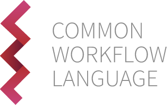
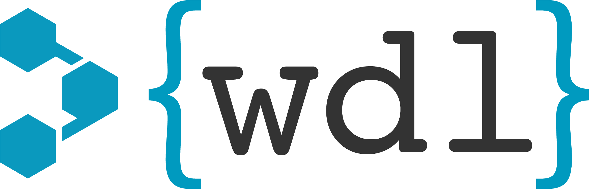

Title: On Bioinformatics Workflow Design
Date: 2024-04-26
Category: commentary
tags: workflows

Since I was in grad school I've been writing bioinformatics [workflows](2019-08-19_the-snakemake-tutorial-i-wish-i-had.html).
Usually to process NGS data. The concept of a workflow is simple, [and not limited to the domain of bioinformatics](https://github.com/spotify/luigi).
However, a workflow (aka "pipeline") used to analyze data from next generation sequencing (again, will it ever be
"current gen?") certainly falls under this banner.

Over the past few years I've become more opinionated on how bioinformatics workflows should be designed. First, we should
have a basic understanding of what a bioinformatics workflow is and what they look like.

### What Is a Bioinformatics Workflow?

If you work in bioinformatics and/or computational biology (really, most fields of science that utilize computational
resources on a medium-large scale) you've probably written a workflow. I would define such a process as a series of
programs, usually (but not always) operating sequentially on the output of the previous tool in the series. A typical
workflow for the analysis of RNAseq data might look like this:

1. QC of raw .fastq data [(fastqc)](https://github.com/s-andrews/FastQC)
2. Trimming of reads to remove adapters and low quality basecalls [(trim_galore)](https://github.com/FelixKrueger/TrimGalore)
3. Alignment of cleaned reads against a reference genome [(STAR)](https://github.com/alexdobin/STAR)
4. Sorting and indexing the alignment .bam file [(samtools)](https://github.com/samtools/samtools)
5. Post-alignment QC [(picard)](https://github.com/broadinstitute/picard)
6. Read per gene counting [(featurecounts)](https://subread.sourceforge.net/)
7. Log file aggregation [(multiqc)](https://github.com/MultiQC/MultiQC)
8. Differential expression analysis [(DESeq2)](https://bioconductor.org/packages/release/bioc/html/DESeq2.html)

This example is pretty straightforward, and is not by any means the entireity of what one may do in the course of RNAseq
analysis (for one, STAR can generate the counts tables directly with no need for featurecounts or other tools). It does
demonstrate the concept though. In most cases, each tool runs on the output file of the previous step, with some
exceptions (fastqc and trim_galore, for example, both operate on the raw data). More complex workflows may feature many
steps which can run in parallel because their outputs are not required as inputs until reaching a later step.

### Common Workflow Frameworks In Bioinformatics

If you've ever written a series of scripts in shell, python, R, or any other language, that uses sequential processes on
one or more input files then you already have a workflow. Most people in bioinformatics that process NGS data begin
writing BASH scripts as both a way to enable hands-off running of workflow steps, and a way to record what work was
performed.

There are many workflow management frameworks in common usage within bioinformatics today. These include (this list is
not exhaustive):

**Note:** I am fully aware that not all of these aspire to also encompass execution, choosing to leave that to separate
tools (CWL, WDL). However, for the purpose of this discussion lumping them together with Nextflow and Snakemake makes
sense logically as workflow languages. I will probably catch flak for this.

This article is not a deep dive on each framework's pros and cons or my opinions on them.

### The "Why" and "When" Of Workflow Automation

Workflow management frameworks do a lot of things for you, but all have a learning curve. They each have unique syntax,
and their own common workflow design idioms. However, if you use a framework like these you'll be able to write once,
run anywhere (in theory). Run locally, fine. Run on an HPC, great. Run on a public cloud (AWS, GCP, Azure), cool. Run on
a kubernetes cluster, probably fine. You get the idea.

These workflow languages and the executors that run them allow efficient resource usage, if you define the resources
required for each step the executor will determine how many of each job can run in parallel. They also excel at
scattering jobs across compute nodes, this is especially important in an HPC or cloud compute context. Importantly, they
(can) enable greater reproducibility. They integrate with container runtimes, allowing you to use Docker, Podman,
Apptainer, et al. for each piece of software in a workflow and guarantee a specific version of each tool is used. This
also eases deployment to HPCs or cloud compute.

In my opinion, you should look to workflow management frameworks when you want:

1. Reproducibility
    - You can rerun an analysis and get reliable, and comparable, results.
2. Automation
    - No need to write scripts for each step, no need for complex scripting to handle resource management.
3. Portability
    - Run the same process agnostic of underlying hardware (local, HPC, cloud, etc.).
4. Harmonization
    - You should have no question about whether data from similar experiments, analyzed with the same workflow, are comparable.
5. Efficiency
    - You are going to run a process many times and you want to reduce execution time and/or costs.

I wouldn't bother uising workflow management frameworks for:

1. Prototyping
    - Write the workflow when you *done* prototyping. Scripts are well-suited for this and it's easier to write
    workflows when you have well-written scripts to start with.
2. One-off analyses
    - Is it really worth it to spend your time on this instead of directly answering your research question? BASH
    scripts are still a thing.
3. Bespoke visualization and statistical analysis
    - This is difficult to standardize and requires careful consideration of data distributions. Consider computational
    notebooks instead.

### Some Bioinformatics Workflow Anti-Patterns

Now I'm going to get controversial.

I have seen these in some high-profile implementations.

1. God Workflows
    - A workflow that actually is for the processing of multiple kinds of -omics data.
    - A workflow that includes specialized processing of the same kind of data in multiple unrelated ways.
    - I have seen these as the buzzword "multi-omics" has become more prevalent.
    - Similar in concept to god functions or [god objects](https://en.wikipedia.org/wiki/God_object). 
2. Filename Implicit Metadata
    - Who isn't guilty of using filenames to store metadata? I am. `sampleID_treatment_replicate.fastq.gz`
    - It's not a problem to store metadata in filenames, per se. It's a problem to **depend** on filenames as the
    ground truth source of file information.
3. Not Actually Automated
    - Workflows which expose far too many options to actually be that useful as automation.
    - Do you really need to allow the changing of **every** option in your steps?
    - This is especially problematic when there are options that are not suitable for a given workflow and should never
    be enabled/disabled.
4. Forgetting To Make Design **Decisions**
    - In the name of providing options to users, you may be tempted to allow multiple programs in different steps.
    - "You can use STAR *or* HISAT2 by running with `--aligner STAR` or `--aligner HISAT2`."
    - Now, saying "I ran `{workflow_name_here}` from the `{fancy_project_name}` github" is not descriptive enough to
    actually inform people what was run.
    - Yes, I am aware log files still exist, but you shouldn't need to look at a log file to at least know the basic
    steps that were executed on some data.
5. Unnecessary Complexity
    - "Real programmers separate all their functions and classes into modules, so each step of my 10 step workflow is in
    a separate file."
    - Breaking up workflows can be done for good reasons, but this isn't one of them.

### Good Practices To Use Instead

To avoid these problems, in order:

1. Embrace Modular Workflows
    - A workflow processes **one** kind of data.
    - A workflow outputs data for **one** purpose (not necessary only one kind of experiment when the same outputs may
    be useful for more than one type of experiment).
    - If you need to integrate multiple -omics types consider higher order workflows, like higher-order functions or
    classes (depending on your preference for functional or object oriented programming).
    - Higher order, or nested workflows, allow the execution of multiple sub workflows which still may be executed just
    as well on their own.
2. First Class Metadata
    - The ground truth for sample information, the metadata, lives elsewhere from the filenames.
    - Link the metadata to the files. Using the filenames and md5 hashes in a separate database is a good option.
    - At a minimum, a low-effort way to solve this just involves a .csv file that has columns for filenames in addition
    to other sample metadata.
    - Use metadata sheets when executing workflows to read sample names and important information related to options
    that need changing for specific samples (paired end read status, etc.)
3. Automate, Automate, Automate!
    - If there are options that should not be changed do not allow users to change them.
    - Every "option" should have a default that you have chosen for **good reason**.
    - You should very rarely *need* to specify an option at execution to successfully and correctly run your workflow.
    - Remember that one of your reasons behind writing a workflow is to automate the thing beyond writing individual
    scripts.
4. Own Your Design Decisions
    - Every tool for each step of your analysis was chosen for a reason, let your users know that.
    - There are exceptions to every rule, but the rule should be **one step, one tool**.
    - If someone thinks their favorite tool is better than the one you picked they can write their own workflow or use
    a different one.
    - It should be clear what happened to the data when you explain "I ran `{workflow_name_here}` from the
    `{fancy_project_name}` github." Yes, log files are still important.
5. Keep It Simple
    - If you have a somewhat small workflow you don't need separate modules for every step, it's actually **less**
    readable.

### In Conclusion

No code today, just thoughts. Maybe you've thought these things but didn't put them into writing. Maybe you're just
coming around to the idea of workflow automation. Maybe you think I'm wrong (in this case, please don't email me I
already get too much email and I'll just delete it anyway). However, I think by keeping a few things in mind you can
really improve both the readability of your workflows and their usefulness.

Thanks for coming to my TED Talk/giant wall o' text. If you like these thoughts I accept payment in the form of cookies,
peanut m&ms, millions of dollars in cash by the briefcase, and mysterious wire transfers in amounts large enough to pay
off my wife and I's student debt.